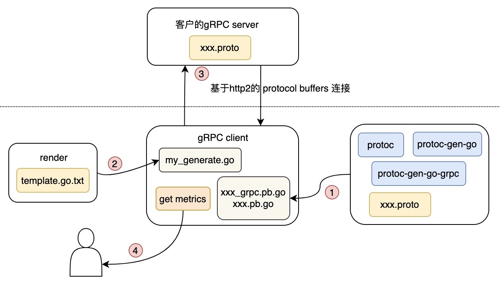

# gRPC 使用的基本步骤
##### 第一步：grpc 的核心就是编写服务定义文件 *.proto  
    我们可以在一个项目中编写多个 .proto 文件（便于多人协同开发）, 或者在 .proto 文件中定义多个 service 模块（便于阅读）
    本demo中是 hello.proto, .proto 文件使用 Protocol Buffers (ˈproʊtəkɑːl) 语法来定义服务和消息。该文件定义了 服务的接口 和 通信协议，以及客户端和服务器之间交换的数据结构。

##### 第二步：服务端编写
    1）服务定义文件写好之后，使用命令生成相应的服务端 go 代码：
        protoc --go_out=.  hello.proto
        protoc --go-grpc_out=.  hello.proto
    2）自定义一个 struct 重载自动生成的 *_grpc.pb.go 代码中的 UnimplementedSayHelloServer struct 
    3）使用重载的 struct，重写 UnimplementedSayHelloServer 的 SayHello 方法（即重写 hello.proto 中声明方法）
    4）在 main 方法中：
        创建网络监听，
        创建一个 gRPC Server，
        将我们自己的 server 对象注册进 gRPC Server，
        启动服务，gRPC Server 开始 lis.Accept，直到Stop

##### 第三步：客户端编写
    1）将服务定义文件hello.proto 也复制一份到客户端
    2）生成客户端gRPC代码，和在服务端的操作命令一样
        protoc --go_out=.  hello.proto
        protoc --go-grpc_out=.  hello.proto
    3）grpc.Dial 连接服务端地址，然后我们创建一个 gRPC客户端对象
    4）使用创建好的客户端对象调用本地的方法，grpc 会将请求发送给服务端对应的方法，并返回响应结果


#### 安全传输
    gRPC 是一个典型的C/S模型，使用 SSL/TLS 方式做服务端认证 或 双向认证。

这里在 Ubuntu 中使用 openssl 来签发证书：
* 给 root CA 生成私钥：
    ```(umask 077; dir=/usr/lib/ssl/demoCA;  openssl genrsa -out $dir/private/cakey.pem 4096) ```

* 生成自签证书(root ca cert)： 
    ``` 
    dir=/usr/lib/ssl/demoCA; \
    openssl req -new -x509 -key $dir/private/cakey.pem -out $dir/cacert.pem  -days 3650  \
    -subj  "/C=CN/ST=BeiJing/L=BeiJing/O=Personal/CN=root ca server/emailAddress=test@163.com" 
    ```

* 签发服务端证书，先临时存放到 /tmp/ssl/ 下面：
    1. 生成私钥: 
        ```(umask 077; openssl genrsa -out /tmp/ssl/server.key 2048) ```
    2. 生成证书签名请求文件:
        ```
        cat > /tmp/ssl/extfile.cnf << EOF
            
        [req_ext]
        subjectAltName = @alt_names
        
        [alt_names]
        DNS.1 = my.grpc.com
        DNS.2 = my.test.com
        IP.1 = 172.16.1.241
            
        EOF
        ```
         
        ``` 
        cat /etc/pki/tls/openssl.cnf  /tmp/ssl/extfile.cnf > /tmp/ssl/openssl.config;
        
        openssl req -new \
        -days 365 \
        -key /tmp/ssl/server.key \
        -subj  "/C=CN/ST=BeiJing/L=BeiJing/O=Personal/CN=my grpc server/emailAddress=yxx@163.com" \
        -config /tmp/ssl/openssl.config \
        -reqexts req_ext \
        -out /tmp/ssl/server.csr 
        ```
    
 * server.csr、extfile.cnf 发给root CA，签发服务端证书：
    ``` 
    openssl ca -days 365 -extensions req_ext -extfile /tmp/ssl/extfile.cnf  -in /tmp/ssl/server.csr -out /usr/lib/ssl/demoCA/certs/server.crt  
    ```
 
 * 验证域名，在客户端 /etc/hosts 中配置 ：
     ``` 
     本机IP my.grpc.com 
     本机IP my.test.com 
     ```

-------
<br>
<br>
<br>
<br>


# 项目需求
客户的服务器上现有gRPC client 和 gRPC server，需要在不影响现有代码和运行环境的情况下，获取 gRPC client 和 gRPC server 的通信指标：
```
    域名解析时长
    建立连接时长
    SSL握手时长
    发出请求时长
    服务器第一次响应时长
    服务器响应结束时长
    发送的数据长度
    响应的数据长度
```

# 设计思路 & 架构
由于客户的.proto文件定义对我们来说是未知的，要想获取这些指标，目前想到的有两种方案：
1. 抓取或监控到客户的client服务的网络数据。
2. 模拟一个gRPC client和gRPC server通信，在应用层获取这些指标。


**思路：** 这里选取第2种，更有把握。
* 我们拿到 *.proto 文件，挑选出需要调用的接口和对应的上下行协议（configs/render_value.yaml）；
* 抽象出一个 Custom Function 来调用这个名字不确定的RPC接口，这样就屏蔽了用户的接口定义（具体如何屏蔽的见模版configs/template.go.txt）。
* 这样我们的代码就不用针对不同的grpc server在单独做开发了，只需要根据配置把模版渲染出来即可。同时，对于我们上层开发者来说，Custom Function 是固定的，也不需要每次改代码了。

-------
架构如下：




### 主要介绍一下 grpc-client 项目结构

```
./
├── README.md
├── bin/                                 # tools to generate gRPC code
│   ├── protoc-gen-go-grpc-osx-x86_64*
│   ├── protoc-gen-go-grpc.exe
│   ├── protoc-gen-go-osx-x86_64*
│   ├── protoc-gen-go.exe
│   ├── protoc-linux-x86_64
│   ├── protoc-osx-arm64*
│   ├── protoc-osx-x86_64*
│   ├── protoc-win64.exe
├── cmd/
│   ├── client/                          # grpc client main
│   ├── render/                          # custom render main
│   └── server/                          # grpc server main
├── configs/                             # config directory
│   ├── hello.proto
│   ├── key/
│   ├── render_value.yaml
│   └── template.go.txt
├── go.mod
├── go.sum
├── internal/
│   ├── client/
│   └── server/
├── media/
│   └── 17065866939745.jpg
├── pkg/                                 # tools
├── scripts/                             # project build and running script
│   ├── client-start.sh*
│   └── server-start.sh*
└── vendor/                              # go mod vendor
```

### 运行
#### 启动 grpc-server:
    sh scripts/server-start.sh


#### 启动 grpc-client:
1. 如果你是在本地调试，并且使用了证书，请配置 hosts: `127.0.0.1 my.grpc.com`


2. 直接运行 sh scripts/client-start.sh，该脚本主要作用：
    1. 编译出 render (render 的主要作用是渲染 template.go.txt)
    2. 使用 bin/protoc* 工具，生成 gRPC client 代码到 internal/proto/ 下面
    3. render 程序渲染 configs/template.go.txt，渲染时会使用 configs/render_value.yaml 中的配置
    4. 编译 grpc client 代码
    5. 启动程序 


#### 获取grpc client连接 grpc server 的网络指标:
* 可以直接调用 internal/client/logic/grpc.go/MockRPC() 函数。
* 如果你在启动 grpc client 时，开启了 http 服务，访问 `/api/v1/metrics/grpc/network?pretty=true` 也可以。最终获取到的指标格式见：internal/client/models/metrics.go 中的 MetricsGRPC

